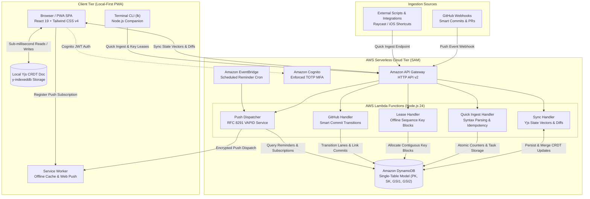

# Lanekeeper

> **A fast, local-first task and project management PWA designed for solo developers and small engineering teams.**  
> *The sweet spot between Todoist (instant, frictionless capture, low latency) and Jira (project keys, kanban workflow lanes, structured metadata, estimation, git automation).*

**Live marketing site:** [www.michaelsanford.com/Lanekeeper](https://www.michaelsanford.com/Lanekeeper/) — runs the real board, quick-capture parser, and `lk` CLI in the browser.

---

## Key Capabilities

- **Local-First CRDT Architecture**: Built on **Yjs** and **y-indexeddb**. Zero-latency local reads and writes, 100% offline functionality, and deterministic conflict-free convergence over AWS Serverless.
- **Deterministic Project Prefixes & Offline ID Leasing**: Predictable issue numbers (e.g. `LK-42`) backed by atomic DynamoDB counters and offline ID reservation leases so you can create tickets while disconnected without number collisions.
- **Amazon Cognito with Enforced TOTP MFA**: Hardware and Software Token MFA (`SOFTWARE_TOKEN_MFA`) with QR code onboarding flow.
- **Today'\''s Flight Deck (Focus Mode - Press `F`)**: Reduces cognitive fatigue by collapsing boards down to 1–3 active cards in flight, overdue/due alerts, and a local markdown scratchpad.
- **Native Web Push Notifications**: Standards-based RFC 8291/8292 VAPID push notifications delivered via Service Worker, with EventBridge scheduled due date reminders.
- **On-Device Voice-to-Task Capture**: Zero-cloud-cost speech-to-task dictation using the native browser Web Speech API.
- **PWA Web Share Target API & App Shortcuts**: Integrated directly into iOS, Android, and macOS native share sheets, plus home screen long-press shortcuts for instant capture.
- **GitHub Smart Commit & PR Ingestion**: Pushing `fix(auth): handle token expiry (fixes LK-42)` automatically transitions `LK-42` to Done and embeds the commit into the task activity log.
- **13 Famous Coding & Roadwork Colour Schemes**: Instant switching between iconic developer palettes (Lanekeeper Midnight, Dracula, Tokyo Night, Catppuccin Mocha, Nord, One Dark Pro, GitHub Dark, Monokai Pro, Gruvbox Dark, Solarized Dark, Campbell PowerShell, Campbell, and Roadworks) with first-class Light and Dark mode support across all themes.
- **Interface Typography & Web Fonts**: Choice of 6 developer-friendly Google web fonts (Inter, JetBrains Mono, Fira Code, IBM Plex Sans, Plus Jakarta Sans, Space Grotesk), OpenDyslexic for reading accessibility, and System Default native OS typography.
- **Multiple Operational Views**: Seamless switching between Kanban Swimlane Board, sortable Data Table view, full-month Calendar schedule view, and single-task Flight Deck focus mode.

---

## Architecture



---

## Quick Ingestion Syntax

Type naturally into the Quick Capture modal (`C` or `Cmd+K`) or via the `lk` CLI:

```text
Upgrade Cognito auth pool #backend #infra !urgent ^tomorrow ~2h @michael
```

| Token       | Meaning        | Examples                                        |
|:------------|:---------------|:------------------------------------------------|
| `text`      | Task Title     | Leading or trailing description                 |
| `#tag`      | Category / Tag | `#backend`, `#frontend`, `#infra`               |
| `!priority` | Task Priority  | `!urgent`, `!high`, `!med`, `!low`              |
| `^due`      | Due Date       | `^today`, `^tomorrow`, `^friday`, `^2026-10-31` |
| `~estimate` | Time Sizing    | `~30m`, `~1h`, `~2.5h`, `~3pt`                  |
| `@assignee` | Team Member    | `@michael`, `@alex`                             |

---

## Quick Local Development (Zero Docker Needed)

### 1. Start Both Backend & Frontend in One Command
```bash
npm install
npm run dev
```
- **Frontend SPA**: Runs at `http://localhost:5173` with Vite HMR, PWA Service Worker, and local-first IndexedDB CRDT store.
- **Backend API Dev Server**: Runs at `http://localhost:3001` with TypeScript hot reload via `tsx`. Vite automatically proxies `/api/*` requests to this backend.

### 2. Seed Sample Tasks (Optional)
```bash
npm run seed
```

### 3. Run Fullstack Test Suite
```bash
npm test
```
Runs the Vitest suites across backend, frontend, and the marketing site.

### 4. Build Fullstack Distribution
```bash
npm run build
```

---

## Marketing Site

`site/` is a separate Vite workspace that publishes the public marketing page at [www.michaelsanford.com/Lanekeeper](https://www.michaelsanford.com/Lanekeeper/). It mounts the actual `KanbanBoard`, `TaskDetailDrawer`, and quick-capture parser from `frontend/src`, driven by local state instead of the CRDT store, plus a terminal running the real `lk` command output.

```bash
npm run dev:site      # http://localhost:5173/Lanekeeper/
npm run build:site    # -> site/dist, for local inspection only
```

Deployment is automatic: `.github/workflows/pages.yml` builds and deploys `site/` to GitHub Pages on every push to `main` that touches `site/**` or `frontend/src/**`. Nothing built is ever committed.

---

## Cloud Deployment (AWS SAM)

When you are ready to deploy the serverless infrastructure to AWS:
```bash
cd backend
sam build
sam deploy --guided
```
Provisions the Cognito User Pool (with TOTP MFA), DynamoDB Single-Table, API Gateway HTTP API, and EventBridge push scheduler in your AWS account.

### Terminal CLI (`lk`)
```bash
export LANEKEEPER_API_URL="https://your-api-id.execute-api.us-east-1.amazonaws.com"
export LANEKEEPER_API_TOKEN="lk_live_your_token"

node cli/lk.mjs add "Investigate memory spike #backend !urgent ~1h"
node cli/lk.mjs list
node cli/lk.mjs start LK-42
```

---

## License
MIT
